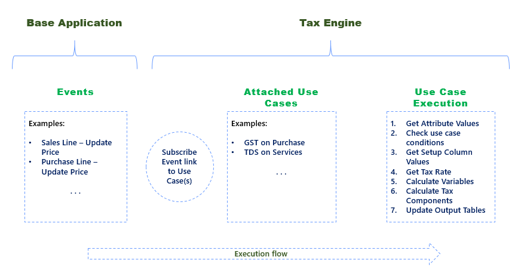

# Tax Engine - Design Consideration

This section contains the pointers that shall be considered while configuring Tax Engine for a Business.

### Why Tax Engine?

- Handling Regulatory Changes

With the help of Tax Engine, regulatory changes can be managed easily without the need of coding in most of the cases. 

Existing use case definitions can be modified, in terms of change of conditions or calculation formulae and redundant use case can be disabled. 

New use case can also be defined.

- Handling Deployment

Since changes are part of configuration, which is data, hence it can be deployed through a file import. If handled through coding approach then it requires publishing and installation of the extension.

### Understanding of Generic Tax Attribute

- When to create an Attribute as Generic?

Generic attributes are used in the same way as item attributes are managed in Business Central. If the attribute is generic in nature, then it doesn’t have any physical field in SQL.

- When to map a tax attribute with a table field?

In case field is already available in the table which is being mapped then it can be linked to that attribute. This means that data for attribute value will be used in that field of table.

### Generic Tax Rate Setup

- Rate Setup for Different Tax Type

Tax Rate Setup of each tax type is configured separately but the User Interface is same, which means that fields in tax rate setup are dynamic based on the tax rate column setup.

- Why Generic Table for Tax Rate Setup?

Use generic table for tax rate setup for all Tax types to handle any new components introduced by government for getting the tax rate.

Example: If there is a regulatory change in which ‘Threshold Limit’ is removed then it can be managed by removing it from the tax rate column setup.

### Generic Metadata

- Tax Transaction Values

This is a common table in which data pertaining to tax calculation with regard to said transaction is stored. If transaction record is deleted then related tax transaction value also gets deleted.

Example: If transaction involves ‘Purchase Line’ then all information related to tax calculation will be stored in tax transaction value. If purchase line is deleted, then tax transaction value record related to that purchase line will also be deleted.

> [!Note]
>
>Information stored in ‘tax transaction value’ is shown in the ‘tax information’ and ‘tax component’ fact boxes related to that transaction. Attributes which have “visible on interface” as true will be visible in the fact box.

- Tax Rate Configuration Value

This table contains the information of tax rate setup, tax engine uses common tax rate setup for types of taxes.

### Execution

- Only Child Use Cases are Executed for Output

There can be a parent child relation between use cases. Parent use cases are help use cases which can be used for defining attribute mapping which is common for one or more use cases.

In case an event is linked with more than one use case having same tax types then its condition should be unique as tax engine will only execute one leaf level use case within one tax type.

- Sequencing of Use Case Execution

The sequence of use case execution depends on the sequencing defined in the related tax use case event.

- Execution of multiple Use Cases for a tax type

If there are more than one use cases for a tax type, then execution will be done sequentially which means that second use case will only execute after completion of first use case.

- Execution Flow of Tax Engine

### Performance

- No Database write operation before Output Mapping

Within tax engine execution, there are no database write operation until the execution comes to the stage of output mapping, this is done to avoid table locking in case tax engine is called by multiple users at the same time.

- No Transaction COMMIT in Execution

Within tax engine execution, there are no transaction COMMIT’s, this is done to make sure that tax engine is not breaking any ongoing functionality in case of error during execution of Use Case.

### Deployment

- Configuration Files

Every use case configured in tax engine is a Json file which can be exported and imported from a Business Central tenant. These configurations are deployed individually for each company.

- Change in Configuration

In case of any change done in any use case to fix a bug or handle regulatory change, the updated configuration should be imported again in each company individually.

- Version Management

In case of any change done in any use case the current active version of the use case is archived and new changed use case version becomes active.

### Enabling and Disabling Configuration

- Enable or Disable for Use Case

In case the use case is no longer applicable, we can disable that use cae which will skip its execution in tax engine.

