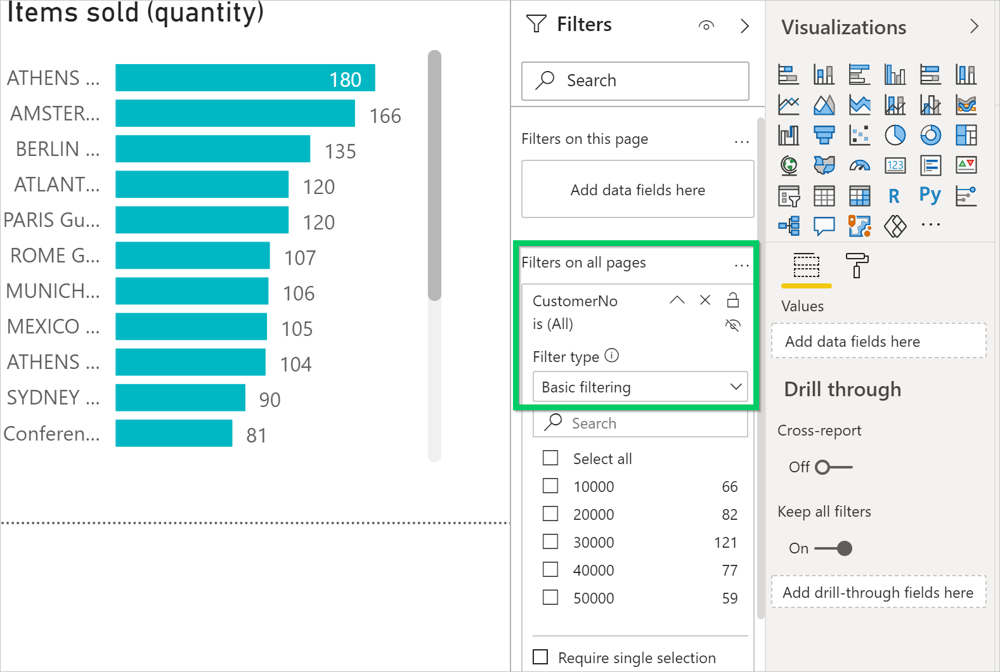
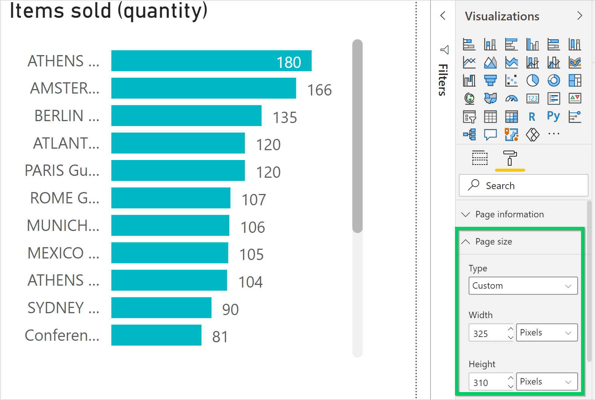

# Creating Power BI Reports for Displaying List Data in [!INCLUDE[prod_short](includes/prod_short.md)]

[!INCLUDE[prod_long](includes/prod_long.md)] includes a FactBox control element on a number of key list pages that provide additional insight into the data in the list. As you move between rows in the list, the report is updated and filtered for the selected entry. You can create custom reports to display in this control. However, there are a few rules to follow to ensure that reports work as expected.  

## Prerequisites

- A Power BI account.
- Power BI Desktop.

For more information about getting started, see [Using [!INCLUDE[prod_short](includes/prod_short.md)] as a Power BI Data Source](across-how-use-financials-data-source-powerbi.md).

## Defining the report data set

Specify the data source that contains the data related to the list. For example, to create a report for the Sales List, ensure the data set contains information related to sales.  

## Defining the report filter

To make the data update to the selected record in the list, you add a filter to the report. The filter must include a field of the data source that's used as the *primary key*. In most cases, the primary key for a list is the **No.** field.

To define a filter for the report, select the primary key from the list of available fields, and then drag and drop that field into the **Report Filter** section. The filter must be a basic report filter that's defined for all pages. It can't be page, visual, or advanced filter.

## Setting the report size and color

The size of the report must be set to 325 pixels by 310 pixels. This size provides the proper scaling of the report in the available space of the Power BI FactBox control in [!INCLUDE[prod_short](includes/prod_short.md)]. To define the size of the report, place focus outside of the report layout area, and then choose the paint roller icon.

You can change the width and height of the report by choosing **Custom** in the **Type** field.

If you want the background of the report to blend with the background color of the Power BI FactBox control, set report background color to *#FFFFFF*. 

## Using reports with multiple pages

With Power BI, you can create a single report with multiple pages. However, for reports that will display with list pages, we don't recommend that they have more than one page. The Power BI FactBox will only show the first page of your report.

## Naming the report

Give the report a name that contains the name of the list page associated with the report. For example, if the report is for the **Vendor** list page, include the word *vendor* somewhere in the name.  

This naming convention isn't a requirement. However, it makes selecting reports in [!INCLUDE[prod_short](includes/prod_short.md)] quicker. When the report selection page opens from a list page, it's automatically filtered based on the page name. This filtering is done to limit the reports that are displayed. Users can clear the filter to get a full list of reports available in Power BI.  

## Fixing problems

This section provides a workaround for the most typical problems that can occur when you create the Power BI report.  

#### You can't see a report on the Select Report page

It's probably because the report's name doesn't contain the name of the list page. Clear the filter to get a full list of Power BI reports available.  

#### Report is loaded but blank, not filtered or filtered incorrectly

Verify that the report filter contains the right primary key. In most cases, this field is the **No.** field, but in the **G/L Entry** table, for example, you must use the **Entry No.** field.

#### Report is loaded, but it shows a page you didn't expect

Verify that the page you want displayed is the first page in your report.  

#### Report appears with an unwanted gray boarder, or it's too small or too large

Verify that the report size is set to 325 pixels x 310 pixels. Save the report, and then refresh the list page.  

## See Related Training at [Microsoft Learn](/learn/modules/configure-powerbi-excel-dynamics-365-business-central/index)

## See Also

[Enabling Your Business Data for Power BI](admin-powerbi.md)  
[Using [!INCLUDE[prod_short](includes/prod_short.md)] as a Power BI Data Source](across-how-use-financials-data-source-powerbi.md)  
[Getting Ready for Doing Business](ui-get-ready-business.md)  
[Setting Up [!INCLUDE[prod_short](includes/prod_short.md)]](setup.md)  
[Finance](finance.md)  
