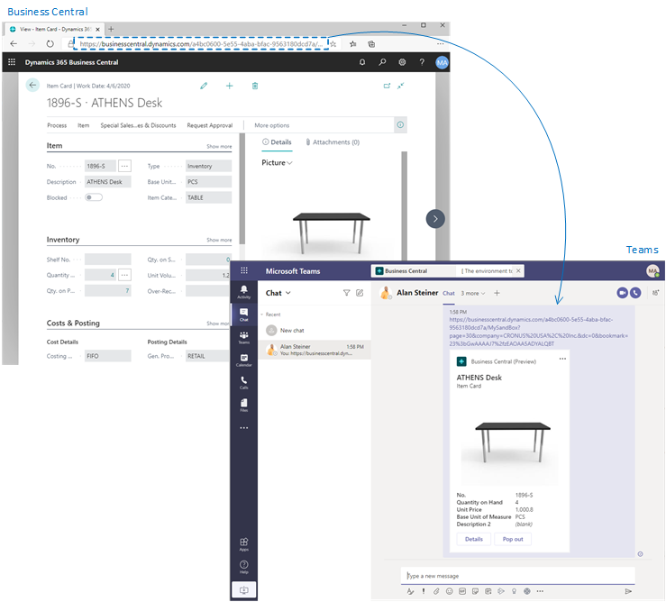

# Working with Business Central in Microsoft Teams

[!INCLUDE [prodshort](includes/prodshort.md)] offers an app that connects Microsoft Teams to your business data in [!INCLUDE [prodshort](includes/prodshort.md)], so you can quickly share details across team members and respond faster to inquiries. The app lets you:

- Copy a link to any Business Central record and paste it into chat to share with your coworkers. The link will expand that into a compact, interactive card that displays information about the record. 
- In the chat, you and coworkers can view more details about the record, edit data, and take action - without leaving Teams. You can also open the record in Business Central, getting the full client experience.

The app is available on the Teams marketplace, and you can use it with the Teams web, desktop, or mobile app.

## Requirements

- Teams subscription.
- [!INCLUDE [prodshort](includes/prodshort.md)] release wave 2 or later.

## Add the Business Central app to Teams

1. Open and sign in to Teams.
2. In the left side, select **Apps**.
3. Search for **Dynamics 365 Business Central**.
4. Select the app when you find it.
5. Read read the information and select **Add**.

## Get started

1. Sign in to Business Central with your browser.
2. Open the record that you want to share.

    The Business Central app for Teams is designed for card and document type pages. You use it on pages that display a single entity, like an item, customer, or sales order. You can't use it for role centers or pages that display several records in a list.

3. Copy the full URL from the browser's address bar.

    Be sure to include the domain name, organization ID, environment ID, and all other parameters, such as the page ID and bookmark.
4. Go to Teams and start a chat.
5. Paste the copied URL into the message box.

6. The first time you paste a Business Central link into chat, you'll be asked to sign in to Business Central. You'll also have to give your consent for the app to retrieve data from Business Central. Follow the on-screen instructions.

    This task is a one-time only task.

7. Wait a moment while a card is generated in the message box.

8. When the card appears, select **Send** to submit the card to the conversation.

    > [!TIP]
    > After the card appears, before you select **Send**, you can delete the pasted URL if you like.

9. To view more details or make changes to the record, select **Details**.

    The window that opens is similar to what you would see in Business Central. But it's slightly trimmed down for Teams. When you're finished viewing and making changes, close the window to return to the Teams chat.

    > [!NOTE]
    > Users must have proper permissions in Business Central to view and edit the record.

## See Also

[Getting Started](product-get-started.md)  

## [!INCLUDE[d365fin](includes/free_trial_md.md)]  
