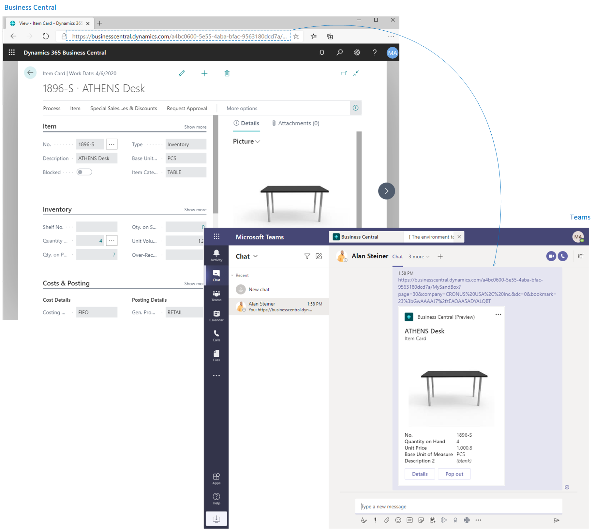

# Working with Business Central in Microsoft Teams

[!INCLUDE [prodshort](includes/prodshort.md)] offers an app that connects Microsoft Teams to your business data in [!INCLUDE [prodshort](includes/prodshort.md)], so you can quickly share details across team members and respond faster to inquiries. The app lets you:

- Copy a link to any Business Central record and paste it into chat to share with your coworkers. The link will expand that into a compact, interactive card that displays information about the record. 
- Once in the chat, you and coworkers can view more details about the record, edit data, and take action - without leaving Teams.

The app is available on the Teams marketplace, and you can use it with the Teams web, desktop, or mobile app.

## Requirements

- A Teams subscription.
- [!INCLUDE [prodshort](includes/prodshort.md)] release wave 2 or later.
- Permissions in Business Central:

  - To paste a [!INCLUDE [prodshort](includes/prodshort.md)] link into Teams and have it expand into a card, you must have at least read access to the target page and its data.
  - Once a card is submitted into a conversation, any user in that conversation can view that card without permission to Business Central. However, viewing more details for a card requires the user to have read permission on the page and its data. If they want to change data, they'll need modify permissions.

## Add the Business Central app to Teams

1. Open and sign in to Teams.
2. In the left side, select **Apps**.
3. Search for **Dynamics 365 Business Central**.
4. Select the app when you find it.
5. Read read the information and select **Add**.

## Include a Business Central record in a Teams chat

1. Sign in to [!INCLUDE [prodshort](includes/prodshort.md)] using your browser.
2. Open the record that you want to share.

    The Business Central app for Teams is designed to display card and document type pages. So use it for pages that display a single entity, like an item, customer, or sales order. You can't use it for role centers or pages that display several records in a list.

3. Copy the entire URL from the browser's address bar.
4. Go to Teams and start a chat.
5. Paste the URL into the message box.
6. The first time you paste a link into chat, you'll be asked to sign in to [!INCLUDE [prodshort](includes/prodshort.md)] and give consent for the app to retrieve data. Just follow the on-screen instructions.

    > [!TIP]
    > You'll only have to do this step once or until you want to change which [!INCLUDE [prodshort](includes/prodshort.md)] Teams connect to.

7. Wait a moment while a card is generated in the message box.

8. When the card appears, select **Send** to submit the card to the conversation.

    > [!TIP]
    > After the card appears, before you select **Send**, you can delete the pasted URL if you like.

9. To view more details or make changes to the record, select **Details**.

    The details page is similar to what you'd see in [!INCLUDE [prodshort](includes/prodshort.md)]. But it's slightly trimmed down for Teams. When you're finished viewing and making changes, close the window to return to the Teams chat.

## See Also

[Getting Started](product-get-started.md)  

## [!INCLUDE[d365fin](includes/free_trial_md.md)]  
